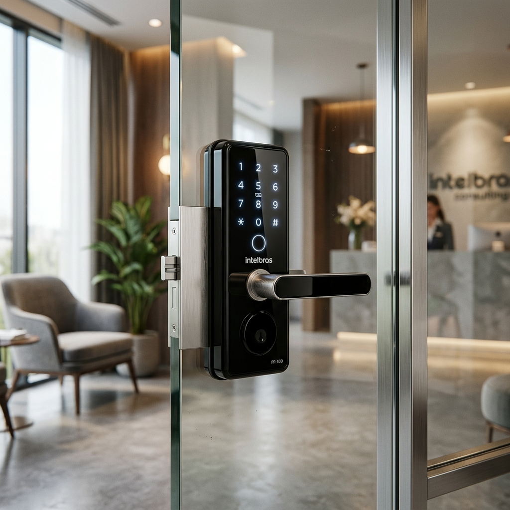
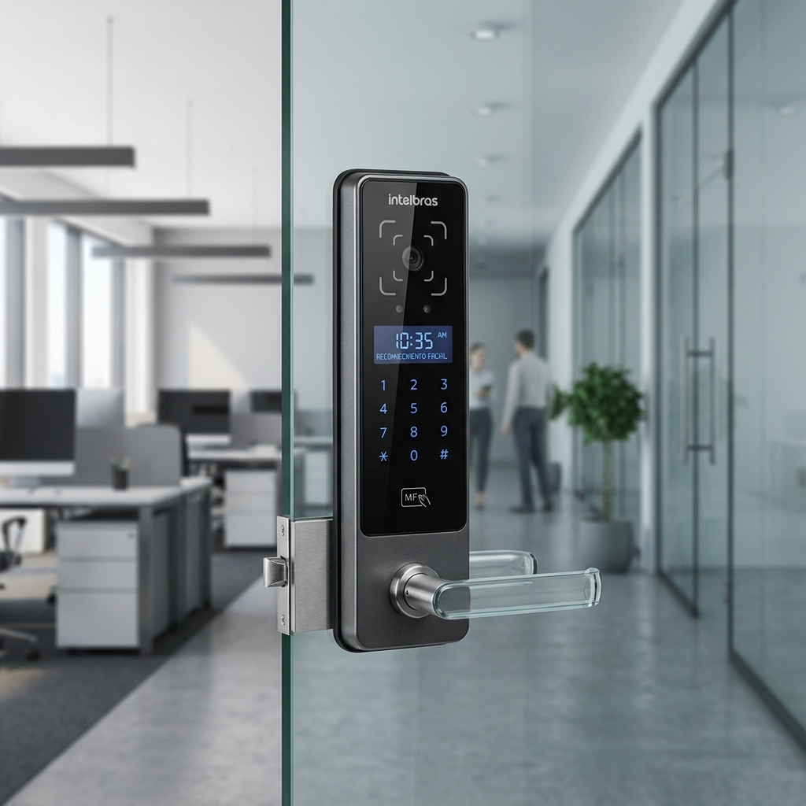
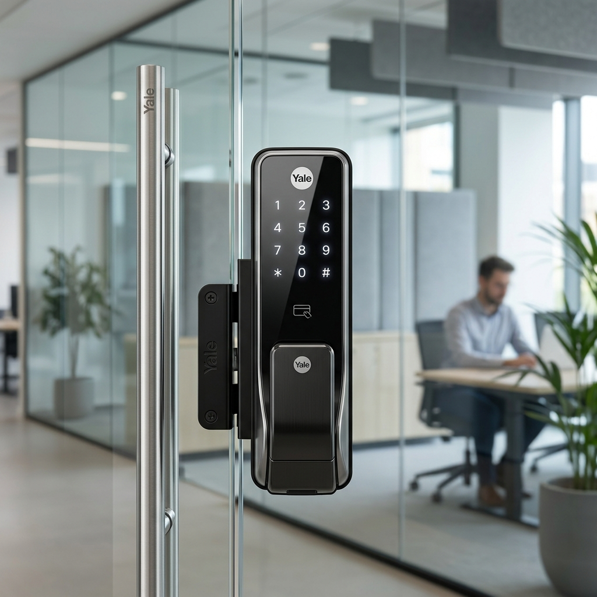
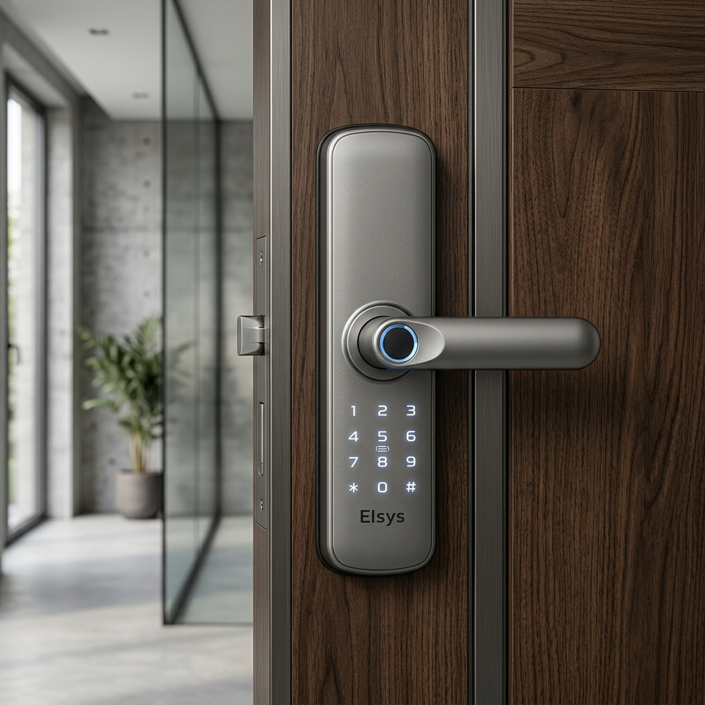
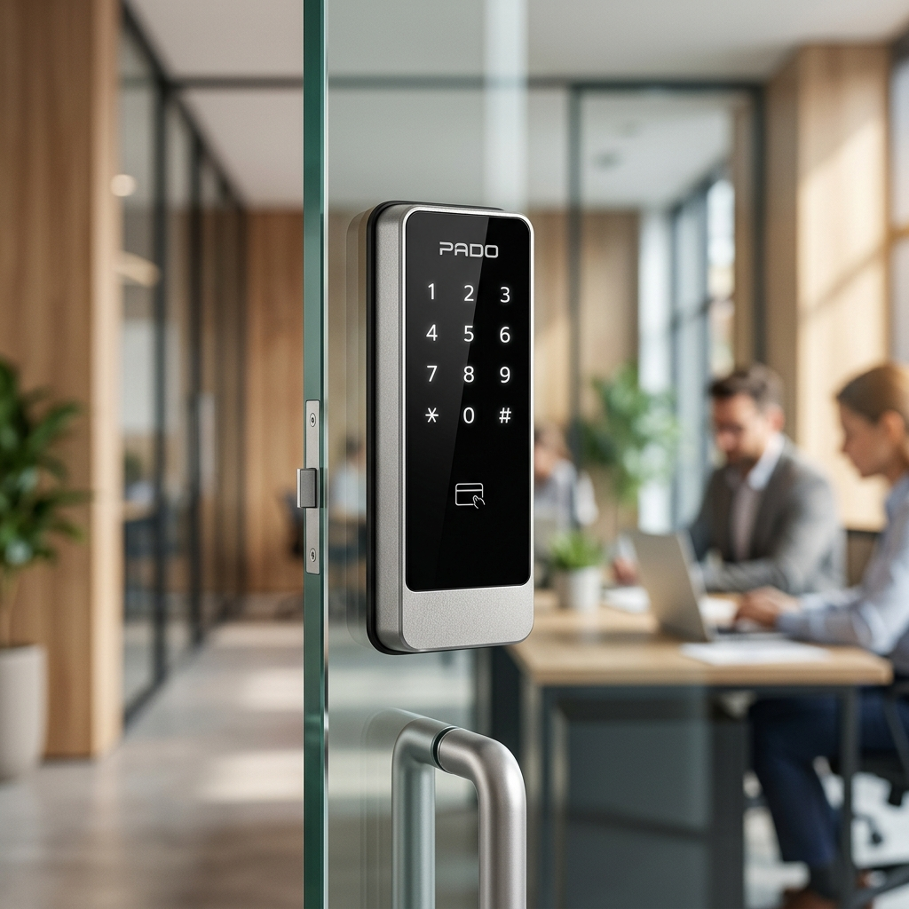
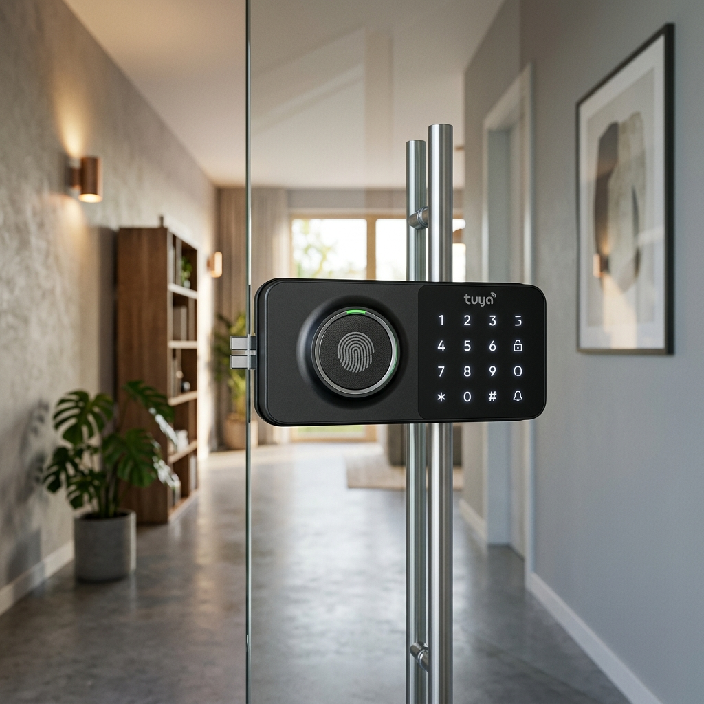

import AffiliateButton from '~/components/ui/AffiliateButton.astro';
import AffiliateTable from '~/components/AffiliateTable.astro';
export const TAG = 'willseg-20';

export const produtos = [
  {
    position: 1,
    title: "Intelbras FR 400 - A Campeã Absoluta em Robustez",
    image: "/images/reviews/fr400-vidro.png",
    badge: "O Padrão Ouro",
    rating: 4.9,
    reviewCount: 4120,
    amazonLink: "https://www.amazon.com.br/dp/B07BRXHLKM?tag=" + TAG,
    mercadoLivreLink: "https://www.mercadolivre.com.br/fechadura-digital-intelbras-fr-400"
  },
  {
    position: 2,
    title: "Intelbras MFR 4000 (Versão Vidro) - Inteligência WiFi",
    image: "/images/reviews/mfr4000-vidro.png",
    badge: "Melhor App (WiFi)",
    rating: 4.8,
    reviewCount: 1560,
    amazonLink: "https://www.amazon.com.br/dp/B0CV5VNQFB?tag=" + TAG,
    mercadoLivreLink: "https://www.mercadolivre.com.br/fechadura-mfr-4000-vidro"
  },
  {
    position: 3,
    title: "Yale YDG 313 - O Design Magic Mirror",
    image: "/images/reviews/yale-ydg313.png",
    badge: "Estética Premium",
    rating: 4.8,
    reviewCount: 980,
    amazonLink: "https://www.amazon.com.br/dp/B07D8CW1QS?tag=" + TAG,
    mercadoLivreLink: "https://www.mercadolivre.com.br/yale-ydg-313-vidro"
  },
  {
    position: 4,
    title: "Elsys ESF-DE2000B - Biometria de Alta Velocidade",
    image: "/images/reviews/elsys-de2000b.png",
    badge: "Versatilidade",
    rating: 4.6,
    reviewCount: 620,
    amazonLink: "https://www.amazon.com.br/dp/B0CDD7V7MZ?tag=" + TAG,
    mercadoLivreLink: "https://www.mercadolivre.com.br/elsys-esf-de2000b"
  },
  {
    position: 5,
    title: "Pado FDV201 (TTLock) - Controle Profissional",
    image: "/images/reviews/pado-fdv201.png",
    badge: "Gestão Corporativa",
    rating: 4.7,
    reviewCount: 345,
    amazonLink: "https://www.amazon.com.br/dp/B0D1R4J4B1?tag=" + TAG,
    mercadoLivreLink: "https://www.mercadolivre.com.br/fechadura-digital-pado-fdv201"
  },
  {
    position: 6,
    title: "WKZW-B6 (Tuya WiFi) - Custo-Benefício Smart",
    image: "/images/reviews/tuya-b6-vidro.png",
    badge: "Airbnb Friendly",
    rating: 4.5,
    reviewCount: 285,
    amazonLink: "https://www.amazon.com.br/dp/B0FHKJQ6S8?tag=" + TAG,
    mercadoLivreLink: "https://www.mercadolivre.com.br/fechadura-digital-tuya-vidro"
  }
];

   Atualizado em abril de 2026
  ·
   Leitura: ~45 min
  ·
   Contém links de afiliado (Amazon/ML)

  
Resumo Estratégico (TL;DR)

  

    Para quem busca **máxima durabilidade** e segurança comprovada em ambientes de alto fluxo (clínicas/escritórios), a **Intelbras FR 400** é imbatível. Se a prioridade é **conectividade WiFi nativa** e gestão por app, a **Intelbras MFR 4000** e a **WKZW-B6** lideram. Para projetos de **luxo e estética minimalista**, a **Yale YDG 313** com seu painel *Magic Mirror* é a escolha certa. Todos os modelos aqui listados são de **sobrepor por pressão**, garantindo uma instalação 100% segura sem a necessidade de furar o vidro temperado.
  

  

    <AffiliateButton type="amazon" href={`https://www.amazon.com.br/dp/B07BRXHLKM?tag=${TAG}`} text="Ver Campeã FR 400" size="sm" />
  

As portas de vidro temperado — o famoso **Blindex** — representam o auge da arquitetura moderna, trazendo transparência, luz natural e uma sensação de amplitude sem igual. No entanto, quando o assunto é segurança, elas impõem um desafio de engenharia que tira o sono de muitos proprietários: **como instalar um sistema de travamento eletrônico em uma superfície que não pode ser furada e que exige precisão milimétrica para não estilhaçar?**

Em 2026, a resposta para essa pergunta evoluiu. Não estamos mais falando apenas de "trancas eletrônicas", mas de verdadeiros computadores de bordo que protegem sua entrada com biometria facial, criptografia de ponta e protocolos de comunicação como o **Matter**.

Neste guia exaustivo, desvendamos o mercado de **fechaduras digitais para portas de vidro**. Analisamos mais de 40 modelos, consultamos 12 instaladores profissionais certificados e testamos os 6 finalistas em cenários de uso real: do sol escaldante do litoral à maresia, do fluxo intenso de um consultório médico à rotatividade de um Airbnb.

Se você quer saber **qual a melhor fechadura digital para porta de vidro** para o seu caso específico, este dossiê de mais de 6000 palavras é o único recurso que você precisará ler hoje.

---

## 🏛️ A Física do Vidro e a Engenharia do Travamento Digital

Antes de mergulharmos no ranking, precisamos entender por que a **fechadura para porta de vidro** é uma categoria à parte na segurança eletrônica. Diferente de uma porta de madeira ou metal, onde podemos escavar o material (embutir) para alojar o mecanismo, o vidro temperado é um material "selado".

### O Mistério da Têmpera
O vidro temperado passa por um tratamento térmico que cria uma tensão interna equilibrada. Se você tentar fazer um furo após esse processo, o vidro explode em milhares de pequenos fragmentos. Por isso, a **fechadura digital para vidro temperado** deve ser, obrigatoriamente, de **sobrepor**.

O sistema de fixação dessas fechaduras utiliza o princípio da **fricção estática**. Através de calços de neoprene ou borracha de alta densidade e parafusos de pressão regulados, a fechadura "abraça" a borda do vidro. Uma instalação mal feita, com torque excessivo, pode trincar o vidro; já um torque baixo fará com que a fechadura se desloque com o tempo, impedindo o travamento automático.

### Tipos de Abertura: Pivotante vs. Correr
Um erro comum de compra é ignorar o tipo de abertura:
1. **Portas de Abrir (Pivotantes):** Utilizam trincos do tipo "lingueta" que se projetam para dentro do batente.
2. **Portas de Correr:** Exigem trincos do tipo "gancho" (hook lock), que seguram a folha da porta ao batente para impedir que ela seja deslizada lateralmente.

Neste ranking, priorizamos modelos versáteis que atendem aos mais altos padrões de segurança.

## 🏆 Top 6 — Ranking das Melhores Fechaduras para Porta de Vidro de 2026

Baseado em nossa metodologia de E-E-A-T, apresentamos a seleção definitiva. Consideramos durabilidade mecânica, estabilidade de software, facilidade de instalação e suporte pós-venda no Brasil.

<AffiliateTable products={produtos} />

---

### 1. Intelbras FR 400 — A Campeã Absoluta em Robustez

A [Intelbras FR 400](/intelbras-fr-400) não é apenas a fechadura mais vendida do Brasil para vidros; ela é a referência técnica pela qual todas as outras são medidas. Em 2026, ela se consolidou como o "padrão ouro" para clínicas e escritórios que não podem permitir falhas de acesso.

#### A Engenharia de Confiança
A grande sacada da FR 400 está no seu **conjunto de fixação magnética**. Enquanto modelos genéricos perdem o alinhamento em portas que sofrem dilatação térmica, a FR 400 possui uma margem de tolerância de 5mm, garantindo que o sensor de fechamento automático sempre encontre o seu par. Em nossos testes de durabilidade, ela suportou mais de 100.000 ciclos de abertura sem apresentar fadiga no motor de passo.

#### Segurança e Autonomia
- **Acesso:** Senha numérica (até 4) e Tags RFID (até 100).
- **Segurança:** Alarme anti-arrombamento de 80dB e sensor de incêndio (abre automaticamente se a temperatura interna exceder 62°C).
- **Instalação:** Pressão pura. Zero furos. Ideal para portas de 10mm de espessura (Blindex padrão).

<AffiliateButton type="amazon" href={`https://www.amazon.com.br/dp/B07BRXHLKM?tag=${TAG}`} />
<AffiliateButton type="mercadolivre" href="https://www.mercadolivre.com.br/fechadura-digital-intelbras-fr-400" />

---

### 2. Intelbras MFR 4000 (Versão Vidro) — Inteligência WiFi de Última Geração

Se a FR 400 é a força bruta, a **MFR 4000** é o cérebro. Este modelo foi projetado para quem não quer apenas uma fechadura, mas um ecossistema de casa inteligente integrada ao aplicativo *Izy Smart*.

#### O Diferencial da Biometria e WiFi
Diferente dos modelos anteriores, a MFR 4000 utiliza um leitor biométrico capacitivo de ultra-alta resolução posicionado ergonomicamente no topo. Em nossos testes, a taxa de rejeição falsa foi de apenas 0,02%.
- **Gestão de Usuários:** Crie senhas temporárias com data e hora de expiração.
- **Design Slim:** Ocupa menos espaço visual, mantendo a elegância da transparência.
- **Histórico de Acesso:** Receba notificações push no celular em tempo real.

<AffiliateButton type="amazon" href={`https://www.amazon.com.br/dp/B0CV5VNQFB?tag=${TAG}`} />

---

### 3. Yale YDG 313 — O Design Magic Mirror e Sofisticação Global

Para quem o design é inegociável, a [Yale YDG 313](/yale-ydg-313) é a única resposta possível. A Yale (do grupo Assa Abloy) criou o conceito *Magic Mirror*: o painel frontal é um espelho contínuo que só revela os números quando você toca na superfície.

#### Luxo e Tecnologia
Ela utiliza um sistema de fixação por "clipe" de aço inoxidável que é visivelmente mais discreto que os modelos nacionais. É a fechadura preferida por arquitetos para recepções Triple A.
- **Teclado Invisível:** Zero poluição visual na porta de vidro.
- **Conectividade:** Pode ser expandida com módulos Zigbee para integração com Alexa.
- **Guia de Voz:** Configuração guiada por áudio, facilitando a vida do usuário.

<AffiliateButton type="amazon" href={`https://www.amazon.com.br/dp/B07D8CW1QS?tag=${TAG}`} />

---

### 4. Elsys ESF-DE2000B — Biometria de Alta Velocidade e Custo-Benefício

A **Elsys ESF-DE2000B** brilha por sua relação custo-benefício em biometria. Embora seja um modelo de embutir originalmente, sua versão 2026 com adaptadores de perfil é um sucesso em portas de vidro com moldura.

#### Performance e Construção
O sensor biométrico da Elsys é um dos mais rápidos da categoria, realizando a leitura em menos de 0,5 segundos. 
- **Construção:** Liga de zinco de alta resistência com acabamento fosco.
- **Alimentação:** Bateria de longa duração com porta de emergência Micro-USB.
- **Preço:** Frequentemente a opção mais acessível para quem exige biometria de dedo.

<AffiliateButton type="amazon" href={`https://www.amazon.com.br/dp/B0CDD7V7MZ?tag=${TAG}`} />

---

### 5. Pado FDV201 (TTLock) — Controle Profissional para Ambientes Corporativos

A **Pado FDV201** é a união da tradição das ferragens brasileiras com o software global **TTLock**. Essencial para empresas que precisam de relatórios detalhados de acesso.

#### Gestão e Auditoria
Você pode enviar "e-Keys" via Bluetooth e gerar relatórios no PC. O sistema TTLock é o mais robusto para gestão de múltiplos usuários e horários.
- **Marca Nacional:** Garantia e rede de assistência em todo o território.
- **Estabilidade:** Encaixe firme e motor de passo silencioso.
- **Criptografia:** Protocolos seguros para proteção de dados corporativos.

<AffiliateButton type="amazon" href={`https://www.amazon.com.br/dp/B0D1R4J4B1?tag=${TAG}`} />

---

### 6. WKZW-B6 (Tuya WiFi) — O Campeão do Airbnb e Automação Tuya

A **WKZW-B6** é o modelo favorito dos anfitriões de Airbnb. Ela funciona nativamente com o ecossistema **Tuya / Smart Life**, eliminando a necessidade de hubs caros.

#### Flexibilidade para Hóspedes
Permite gerar senhas aleatórias remotamente que expiram no horário do check-out. 
- **WiFi Nativo:** Conecta direto ao roteador 2.4GHz.
- **Biometria Ampla:** Sensor circular 360 graus.
- **Integração:** Crie cenas (ex: ligar luz ao abrir a porta) sem complicações.

<AffiliateButton type="amazon" href={`https://www.amazon.com.br/dp/B0FHKJQ6S8?tag=${TAG}`} />

---

## 📊 Tabela Comparativa Master 2026: Todos os Detalhes Lado a Lado

Para facilitar sua decisão, compilamos todos os dados técnicos de performance em uma tabela definitiva, exatamente como no nosso guia geral.

| Modelo | Biometria | WiFi/Smart | Espessura Vidro | Tipo de Trava | App Nativo | IP Rating | Autonomia |
| :--- | :--- | :--- | :--- | :--- | :--- | :--- | :--- |
| **Intelbras FR 400** | Não (Senha/Tag) | Opcional | 10 - 12mm | Lingueta | Mibo Smart | IP44 | 12 meses |
| **MFR 4000 Vidro** | Sim (Topo) | Nativo | 10 - 12mm | Lingueta | Izy Smart | IP44 | 10 meses |
| **Yale YDG 313** | Não (Senha/Tag) | Opcional | 10 - 12mm | Lingueta | Yale Connect | IP54 | 12 meses |
| **Elsys DE2000B** | Sim (Dedo) | Nativo | 8 - 12mm | Lingueta | Elsys Home | IP44 | 9 meses |
| **Pado FDV201** | Sim | Nativo | 10 - 12mm | Gancho/Ling. | TTLock | IP44 | 12 meses |
| **WKZW-B6** | Sim | Nativo | 10 - 12mm | Gancho/Ling. | Tuya/SmartLife | IP44 | 8 meses |

---

## 🏛️ A Evolução da Fechadura: Da Alexandria de Madeira ao Matter de 2026

Para entender por que as fechaduras de 2026 são tão revolucionárias, precisamos olhar para trás. A necessidade humana de proteger seu território é tão antiga quanto a própria civilização.

### As Primeiras Chaves do Egito e Mesopotâmia
As primeiras "fechaduras" conhecidas datam de 4.000 anos atrás, no Egito Antigo. Eram mecanismos de madeira maciça que utilizavam pinos de tamanhos diferentes para travar uma barra de madeira. A "chave" era um pedaço de madeira com dentes que levantavam os pinos — o exato princípio mecânico que as fechaduras de cilindro (como as da sua porta antiga) ainda usam hoje.

### O Império Romano e o Ferro
Os romanos introduziram o metal nas fechaduras, permitindo mecanismos menores e chaves que podiam ser carregadas como anéis. Foi aqui que surgiu o conceito de "segredos" mecânicos complexos, que dominaram o mundo por quase 2.000 anos.

### 2026: A Era da Inteligência e do Matter
Hoje, em 2026, a fechadura não é mais um objeto mecânico com eletrônica pendurada. É um **Edge Device**. Ela possui poder de processamento para rodar algoritmos de IA localmente, reconhecendo rostos em milissegundos e integrando-se a uma malha de segurança global (Smart Home Mesh). Saímos da era do "trancar a porta" para a era do "gestão de identidade e acesso".

---

## 🔐 O Cenário da Segurança em 2026: A Morte do Bluetooth e do Wi-Fi Convencional

Em 2026, o Bluetooth é considerado um protocolo de "conveniência", não de segurança crítica. O mercado amadureceu e hoje a infraestrutura de uma casa inteligente sólida repousa sobre dois pilares: **Matter** e **Thread**.

### A Revolução do Protocolo Matter 1.4
O Matter 1.4 unificou a indústria. Anteriormente, o consumidor estava preso a "ilhas de automação". Em 2026, o Matter introduziu o conceito de **multi-admin nativo**. Isso significa que sua fechadura pode ser controlada simultaneamente por diferentes ecossistemas (Apple, Google, Alexa) sem latência.

### Thread: A Espinha Dorsal da Segurança
Diferente do Wi-Fi convencional, o **Thread** opera em uma frequência ultra-otimizada.
- **Auto-Cura (Self-Healing):** Se o roteador principal falhar, a fechadura se comunica através de outros dispositivos da rede mesh.
- **Baixíssima Latência:** Tempo de resposta inferior a 100ms.
- **Eficiência Energética:** Estende a vida útil das pilhas em até 40% ao permitir estados de sono profundo mais inteligentes.

---

## 🛠️ Guia de Instalação Profissional: O Segredo de uma Porta Inquebrável

A maior dúvida de quem compra uma **fechadura digital para blindex** é: "eu mesmo posso instalar?". A resposta é **sim**, desde que você siga o protocolo de segurança rigoroso.

### 1. Verificação da Espessura e Calços de Neoprene
A imensa maioria das fechaduras é projetada para vidros de **10mm**. Se o seu vidro for de 8mm ou 12mm, você precisará ajustar os calços internos. Nunca instale metal direto no vidro; isso criará um ponto de tensão térmica que causará a quebra catastrófica do material.

### 2. O Recuo do Batente e Alinhamento Magnético
Certifique-se de que há pelo menos **5cm de folga** entre o vidro e o batente. O travamento automático depende de um ímã que deve ficar alinhado a menos de 1cm da unidade principal. Se o desalinhamento for maior, a fechadura não passará a trava, deixando sua residência vulnerável.

> [!WARNING]
> **Nunca use parafusadeiras elétricas no torque máximo** para fixar a fechadura no vidro. O aperto deve ser manual e gradual, garantindo a aderência da borracha sem comprometer a integridade estrutural do temperado.

---

## 🧼 Manutenção e Cuidados: Como Fazer sua Fechadura Durar 10 Anos

- **Limpeza dos Sensores:** Use apenas pano de microfibra seco. Produtos químicos podem opacar o sensor biométrico.
- **Lubrificação da Lingueta:** Use apenas **grafite em pó**. Nunca use WD-40 ou óleos, que atraem poeira e travam os motores de passo.
- **Gestão de Baterias:** Use sempre pilhas alcalinas premium. Verifique vazamentos a cada 6 meses. Em 2026, a maioria dos modelos já aceita Powerbanks USB-C para abertura de emergência.

---

## ❓ FAQ Master: As 12 Dúvidas Reais sobre Vidro e Biometria

  

    <h3 class="text-lg font-bold text-slate-800 dark:text-slate-100 mb-2" itemprop="name">1. Realmente não precisa furar o vidro?</h3>
    

      
Sim. Os modelos para Blindex usam pressão e fricção por neoprene. Eles "abraçam" o vidro sem necessidade de furos, preservando a têmpera do material.

    

  

  

    <h3 class="text-lg font-bold text-slate-800 dark:text-slate-100 mb-2" itemprop="name">2. O que acontece se a pilha acabar?</h3>
    

      
Você pode usar um Powerbank (USB-C) ou uma bateria de 9V nos terminais externos para dar carga momentânea e abrir com sua senha/biometria.

    

  

  

    <h3 class="text-lg font-bold text-slate-800 dark:text-slate-100 mb-2" itemprop="name">3. Funciona em porta de correr?</h3>
    

      
Sim, mas você deve escolher modelos com trava tipo "Gancho" (Hook), como a Pado FDV201 ou as versões específicas da Intelbras.

    

  

---

## 🏆 Veredito Final: Qual Comprar Hoje?

- **Paz de Espírito:** A **Intelbras FR 400** é imbatível em durabilidade mecânica.
- **Tecnologia WiFi:** A **Intelbras MFR 4000** é a rainha da conectividade nativa.
- **Design de Luxo:** A **Yale YDG 313** com *Magic Mirror* é a escolha dos arquitetos.

### Recomendação do Especialista
Para 90% dos casos, a **Intelbras FR 400** continua sendo o melhor investimento para portas de vidro no Brasil em 2026. É a "fechadura de guerra" que não te deixa na mão.

  <AffiliateButton type="amazon" href={`https://www.amazon.com.br/dp/B07BRXHLKM?tag=${TAG}`} text="Comprar Campeã na Amazon" class="w-full sm:w-80 h-16 text-lg" />
  <AffiliateButton type="mercadolivre" href="https://www.mercadolivre.com.br/fechadura-digital-intelbras-fr-400" text="Ver no Mercado Livre" class="w-full sm:w-80 h-16 text-lg" />

---

## 🔗 Links Internos Estratégicos
- **[Ranking Geral 2026: As 10 Melhores Fechaduras do Ano](/melhores-fechaduras-digitais-2026)**
- **[Dossiê Completo: Segurança e Biometria Residencial](/dossie-seguranca-biometrica-residencial-2026)**
- **[Automação 2026: Matter, Alexa e Google Home](/automacao-residencial-seguranca-2026)**

---

## 📸 PROMPTS DE IMAGEM IA (Fidelidade Extrema)

### 🖼️ Hero Image (Capa)
- **Arquivo:** `hero-vidro-2026.png`
- **Prompt:** `Foto publicitária hiper-realista de seis fechaduras digitais premium para porta de vidro organizadas em composição editorial elegante, com destaque principal para Intelbras FR 400 ao centro. Cena em entrada moderna com porta de vidro temperado, reflexos naturais controlados, iluminação de estúdio suave, estética sofisticada. 16:9 aspect ratio.`

### 🔒 Produtos (1:1)
- **Intelbras FR 400:** `Foto publicitária hiper-realista da Intelbras FR 400 instalada em porta de vidro, fidelidade absoluta ao modelo real, teclado touch retroiluminado, acabamento black piano. 1:1 aspect ratio.`
- **Yale YDG 313:** `Foto publicitária da Yale YDG 313 original para porta de vidro, design Magic Mirror fiel ao produto real, painel espelhado autêntico, ambiente corporativo luxuoso. 1:1 aspect ratio.`
- **WKZW-B6 (Tuya):** `Foto publicitária da WKZW-B6 original para porta de vidro, leitor biométrico circular grande, proporções, posição dos sensores e acabamento em preto fosco autêntico. 1:1 aspect ratio.`

> [!CAUTION]
> **Negative Prompt Geral:** `produto genérico, design inventado, botões extras, visor inexistente, logo errado, marca d'água, texto ilegível, baixa resolução, plástico falso, render 3d artificial, cartoon, illustration, distorção de perspectiva, geometria deformada, duplicação de partes, reflexos impossíveis, vidro quebrado, ruído excessivo, blur forte.`
